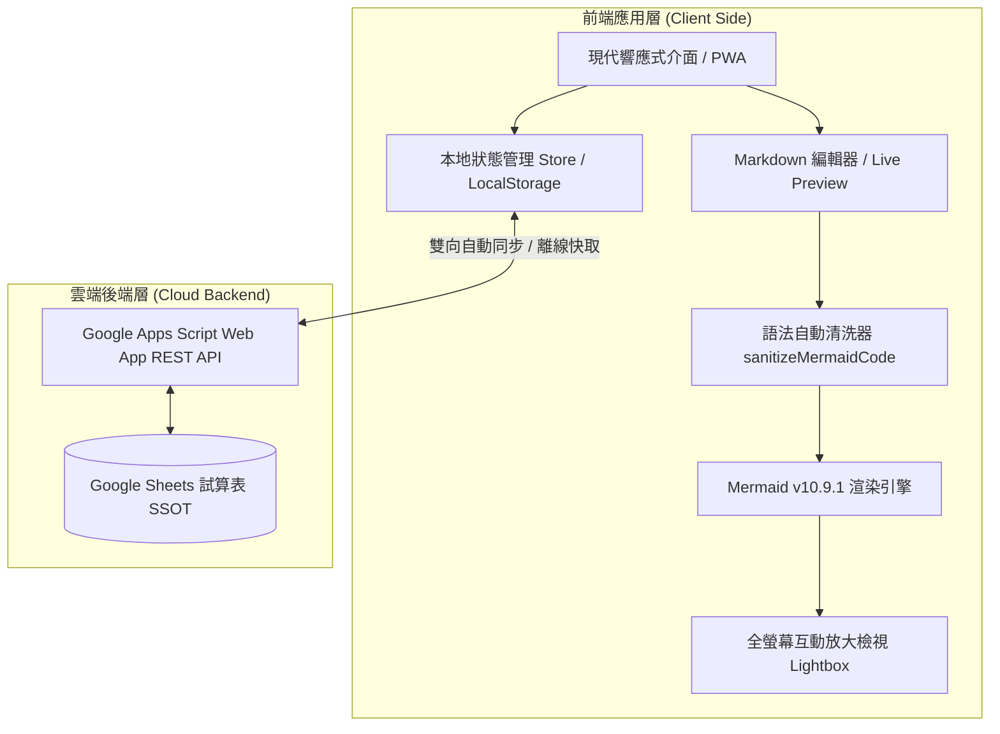
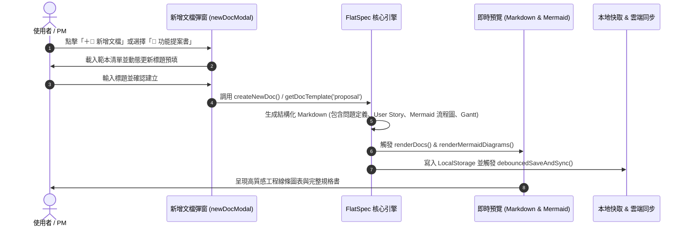
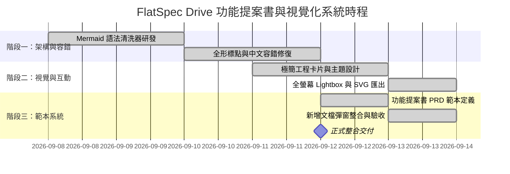

# 🚀 功能提案書 (Feature Proposal / PRD)
## FlatSpec Drive：Mermaid 視覺化圖表高階渲染與結構化文檔範本系統

> **專案名稱**: FlatSpec Drive - 專案設計與執行系統  
> **提案負責人**: FlatSpec 核心產品與架構團隊  
> **提案日期**: 2026-09-12  
> **當前狀態**: 🟢 已核准並完成實裝 (Approved & Implemented)  
> **優先級**: P0 - Blocker / Core Feature  
> **版本範圍**: v1.2.0  

---

## 1. 提案背景與問題定義 (Problem Statement)

### 1.1 背景說明
FlatSpec Drive 是一套具備離線優先能力、Google Apps Script 雲端雙向同步、聶永真極簡線條美學（Minimalist Engineering Style）的現代專案文檔與任務執行系統。隨著使用者在專案中管理複雜的軟體架構、業務流程與時程甘特圖，標準 Markdown 純文字已無法滿足高維度的架構溝通需求。

### 1.2 當前核心痛點
1. **Mermaid 中文輸入容錯率低**：使用者在輸入中文全形標點（例如 `flowchart TD，A([開始])` 或全形箭頭 `──＞`）時，Mermaid 原生 Lexer 會拋出 `Lexical error on line 1`，導致圖表損毀中斷。
2. **缺乏結構化範本引導**：使用者新增文檔時僅有空白文檔，缺乏規範化的「功能提案書 (PRD)」、「技術架構書」與「會議紀錄」範本，需耗費大量時間重複排版。
3. **大圖檢視困難**：複雜的系統流程圖或心智圖在行動端與筆電窄螢幕上文字過小，難以自由放大平移 (Zoom & Pan) 與匯出為高畫質向量圖 (SVG)。

---

## 2. 目標與非目標 (Goals & Non-Goals)

### 🎯 核心目標 (Goals)
1. **智能中文語法容錯**：提供 `sanitizeMermaidCode` 自動清洗與轉換全形逗號、分號、全形箭頭與格式錯誤。
2. **多維度結構化範本**：在新增文檔時提供 **🚀 功能提案書**、**🛠️ 技術規格書**、**📋 會議紀錄**、**🐞 缺陷排查報告** 等標準範本。
3. **極簡高階畫布與全螢幕 Lightbox**：提供微點陣工程背景、自適應置中、全螢幕縮放 (20%~500%)、滑鼠拖曳平移、以及一鍵匯出 SVG 向量圖。
4. **離線與跨裝置無縫同步**：整合 LocalStorage、IndexedDB 快取與 Google Apps Script 雲端資料庫。

### 🚫 非目標 (Non-Goals)
1. 本階段不包含第三方即時協作伺服器（WebRTC/CRDT），維持輕量化 SSOT 雲端輪詢與離線快取機制。

---

## 3. 目標使用者與情境分析 (User Stories)

| 角色 (Persona) | 使用情境 (User Story) | 預期效益 (Benefit) |
| :--- | :--- | :--- |
| **產品經理 (PM)** | 作為 PM，我需要一鍵生成標準「功能提案書」與甘特圖時程 | 節省 80% 規格撰寫時間，規範團隊文檔標準 |
| **系統架構師 (Architect)** | 作為架構師，我需要繪製高清晰度流程圖並隨時匯出 SVG 放入提案簡報 | 向量圖不失真，溝通成本大幅降低 |
| **全端工程師 (Developer)** | 作為開發者，我需要查閱清晰的資料欄位 Schema 與 API 規格 | 避免邊界情境誤解，提升交付品質 |
| **行動端用戶 (Mobile User)** | 作為手機用戶，我需要透過觸控全螢幕檢視與放大流程圖 | 即使在手機螢幕也能清晰閱覽大型架構圖 |

---

## 4. 系統架構與業務流程圖 (Architecture & Flow)

### 4.1 系統資料流架構

### 4.2 文檔建立與範本生成流程

---

## 5. 功能規格與詳細設計 (Specifications)

### 5.1 文檔範本庫規格 (Template System)
1. **🚀 功能提案書 (Feature Proposal / PRD)**：
   - 包含：提案背景、目標/非目標、User Story 矩陣、Mermaid 流程圖、詳細規格、驗收標準、Gantt 甘特圖。
2. **🛠️ 技術架構與 API 規格書 (Tech Spec)**：
   - 包含：系統架構圖 (Graph TD)、RESTful API 規格表、安全性與快取機制。
3. **📋 專案會議紀錄與決策追蹤 (Meeting Notes)**：
   - 包含：討論要點、決策 Checklist、行動待辦指派。
4. **🐞 缺陷排查與除錯報告 (Bug Investigation)**：
   - 包含：重現步驟、根本原因分析 (Root Cause)、修復驗證。

### 5.2 Mermaid 互動工具列與卡片設計
- **圖表類型智慧識別**：自動識別 `FLOWCHART`、`SEQUENCE`、`CLASS`、`STATE`、`ER`、`GANTT`、`PIE`、`MINDMAP`、`TIMELINE`。
- **全螢幕 Lightbox 放大鏡**：
  - 縮放範圍：`20%` ~ `500%`，支援滑鼠滾輪與快捷鍵。
  - 拖曳平移 (Pan)：滑鼠按住自由拖曳。
  - 一鍵還原：`100%` 快速重設。
- **高解析 SVG 向量匯出**：
  - 一鍵提取 DOM 內的 SVG 節點，封裝 XML 命名空間並輸出 `.svg` 檔案下載。

---

## 6. 驗收標準 (Acceptance Criteria)

- [x] **AC-1 (中文全形容錯)**：輸入 `flowchart TD，A([開始])` 或全形箭頭 `──＞` 能自動轉換並正常繪製，不發生 Lexical Error。
- [x] **AC-2 (範本選擇機制)**：點擊「新增文檔」可切換 5 種範本，標題與內容會自動聯動填入。
- [x] **AC-3 (全螢幕燈箱操作)**：點擊圖表「🔍 放大」能開啟獨立 Lightbox，支援滑鼠滾輪縮放、滑鼠拖曳平移及 ESC 鍵退出。
- [x] **AC-4 (SVG 匯出)**：點擊「💾 匯出 SVG」能立即下載高解析 `.svg` 向量圖檔。
- [x] **AC-5 (離線儲存與雲端同步)**：新建或修改之提案書能在離線狀態下安全保存，連線後自動雙向同步至 Google Sheets。

---

## 7. 實施時程規劃 (Milestones & Timeline)

